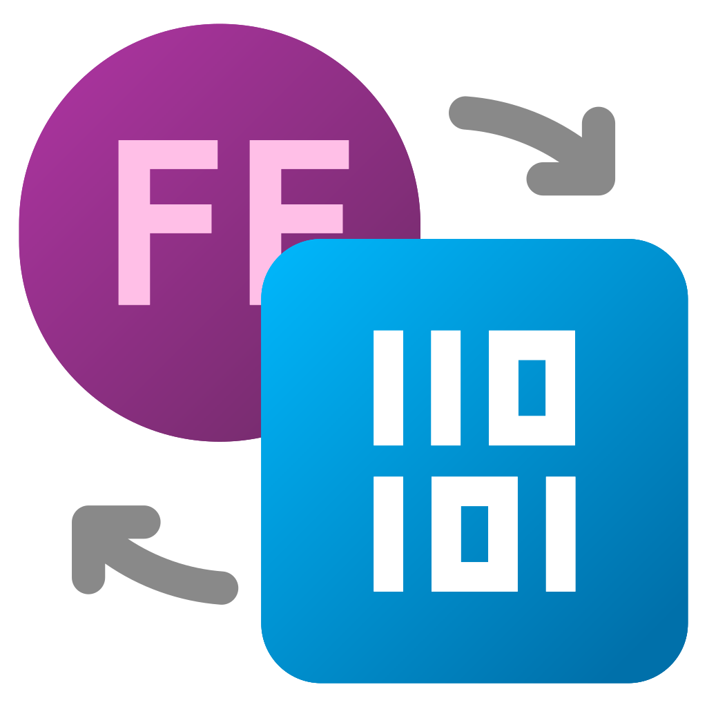

<div align="center">


<h1 align="center"><span style="font-weight: bold">Dev Numbers</span> <br /><span style="font-weight: 200">for Command Palette</span></h1>

</div>

This extension allows you to display and calculate various numerical values using [PowerToys Command Palette](https://learn.microsoft.com/en-us/windows/powertoys/command-palette/overview).

## Features

Conversion between various number systems (decimal, hexadecimal, octal, binary).

16-bit byte-swapped output for values represented by two bytes.

Automatic detection of common format patterns:
  - C style (e.g., `0x1A3F`)
  - C++ style (with apostrophe digit group separator; e.g., `0x123'ABCD`)
  - C# style (with underscore digit group separator; e.g., `0x_1A3F_1230`, `0b_1011_1010`)    
  - VB style (e.g., `&H1A3F`, `&O755`, `&B1010`)
  - Suffixes (e.g., `1A3Fh`, `755o`, `123dec`, `1010bin`)
  - Special characters (e.g., `#1A3F`, `@755`, `$1010`)
  - ADA, LISP, R-style, etc.

Specify explicit bit length using the `/length` parameter, useful for truncating or converting of negative numbers.

```
-123 dec -> 85 hex
-123 dec /length:dword -> FFFF FF85 hex
-123 dec /length:16 -> FFFF FF85 hex
```

## Installation

> **Note:** This extension requires [Microsoft PowerToys](https://apps.microsoft.com/detail/xp89dcgq3k6vld) to be installed.

### Microsoft Store installation (recommended)

<a href="https://apps.microsoft.com/detail/9PFN6H5D5XPN"></a>

## Licence

Apache 2.0

## Author

[Jiří Polášek](https://jiripolasek.com)